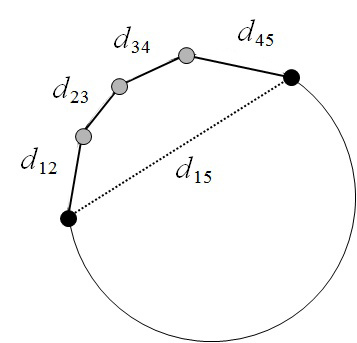

# Double Fusion

使用数据驱动模板拟合，从单帧深度相机帧中同时重建几何信息，非刚性动作和人体形状

主要贡献点：双层表示：身体形状参数和外表面融合

基于双层表示的关节点动作追踪方法

## Introduction

类似 DynamicFusion等方法可以使用单一深度摄像头，在没有预先扫描模型模板的情况下实时动态重建。并且系统代价低，简单配置。但是这些任然受限于慢动作

### BodyFusion

使用骨骼正则化非刚体形变有利于捕捉人类行为。但是由于人类关节点太稀疏并且由于只使用渐变融合表皮来追踪，所以在动作较快的时候会跟踪失败。并且骨架嵌入表示严重依赖于初始化。不准确的骨架嵌入会导致追踪和动作形变的恶化

除了骨骼，身体形状也是很好的先验信息，所以我们提出了BodyFusion

1. 由外表面层 和 内在身体层用来重建和深度配置 组成的双层表面表示
2. 观察到的外表面逐渐融合和形变，内在身体层的形状和姿势参数同样逐渐优化匹配外表面

内在身体层约束外表面在哪里进行几何融合

逐渐融合的外表面也提供了越来越多的约束来更新身体形状和姿势

## Related Work

人体动态几何重建方法分为三类：基于静态模板、基于模型、不限制的重建

### Static Template

对于动作捕捉而言：一些工作基于预先扫描的模板。因此表面重建的工作转变成了，动作追踪和表面形变的问题。

1. 基于多视角轮廓以及时空特征约束驱动的带有骨骼嵌入的模板方法
2. 处理多个互动表演者的方法
3. 随机森林预测对应的模板，然后用模板拟合深度数据
4. 相似表皮模型估计形状和姿势参数

除了带有骨骼嵌入的模板方法，还有一些工作使用基于非刚性表面形变的模板。

1. 利用嵌入形变图来参数化与扫描模板生成局部尽可能刚性的形变
2. $l_0$正则约束 在没有明确骨架嵌入情况下的动作

### Model-based

基于模型的有：SCAPE、SMPL、Dyna模型

一些工作使用形状先验来增强更通用的约束来捕获动态肢体

### Free-form

不使用任何几何先验，为了融合可见部分到复杂的几何中，算法需要估计非刚性动作的准确性

同样需要准确的几何来估计准确的动作

1. 线性方差形变(linear variational deformation)
2. 形变图(deformation graph)
3. 子空间形变(subspace deformation)
4. 结构形变(articulate deformation)
5. 4D时空表面（4D spatio-temporas surface）
6. 不可压缩流（incompressible flows）
7. 动画制图 (animation cartography)
8. 准刚性运动 （quasi-rigid motions）
9. 方向场（and directional field）

## Overview

### Surface Representation

输入深度流信息，输出的是目标人的双层表面

Outer layer：可观察的表面区域

Inner layer：基于SMPL的人体形状和骨骼模型

Outer surface的动作被一个节点集合参数化。每个节点通过刚性转换形变

节点图通过内联关系约束节点使得节点的形变都是相似的

我们在SMPL模型上预定义一个on-body 节点图，这个节点图提供了语义和真实先验信息来约束非刚性动作。可以防止错误的身体part连接。

我们统一采样并使用geodesic distance 在SMPL的平均形状上构造预定义的on-body 节点图

On-body节点固定的绑定在SMPL骨骼关节点上。

接近内身体的Outer surface 区域同样绑定在on-body节点图上

远离身体的形变不能准确的被on-body图所表示，所以我们用$\delta = 5 cm$半径在far-body几何上附加采样了far-body节点

距离on-body点距离超过$1.4 \times \delta cm$的体素标记为far-body

#### geodesic distance

测地距离就是测量地表两点之间最短路径的距离，平均测地距离(Average geodesic distance)作为三维几何特征时，可以用来衡量模型点与模型中心的偏离程度

欧氏距离：如下图的$d_{15}$

测地距离：作为实际路径的最短距离，其距离应为沿途实线段距离之和的最小值 : $d_{12} + d_{23}+d_{34}+d_{45}$

平局测地距离就是 任取一个点，计算其他点距离该点距离的平均值，在该点越接近模型中心的情况下，该平均值会越小。

测地距离的关键就是获取两点之间的最短距离，所以实现算法一般可以使用**Dijkstra's algorithm**

[几何特征系列：Average Geodesic Distance（平均测地距离）](http://lemonc.me/average-geodesic-distance.html)

### Inner Body Model:SMPL

高效的线性身体模型，24个关节点，6890个顶点，每个关节点有3个自由度的旋转角。包括全局的root关节所以一共有$3 \times 24 +3 = 75$个姿势参数。
