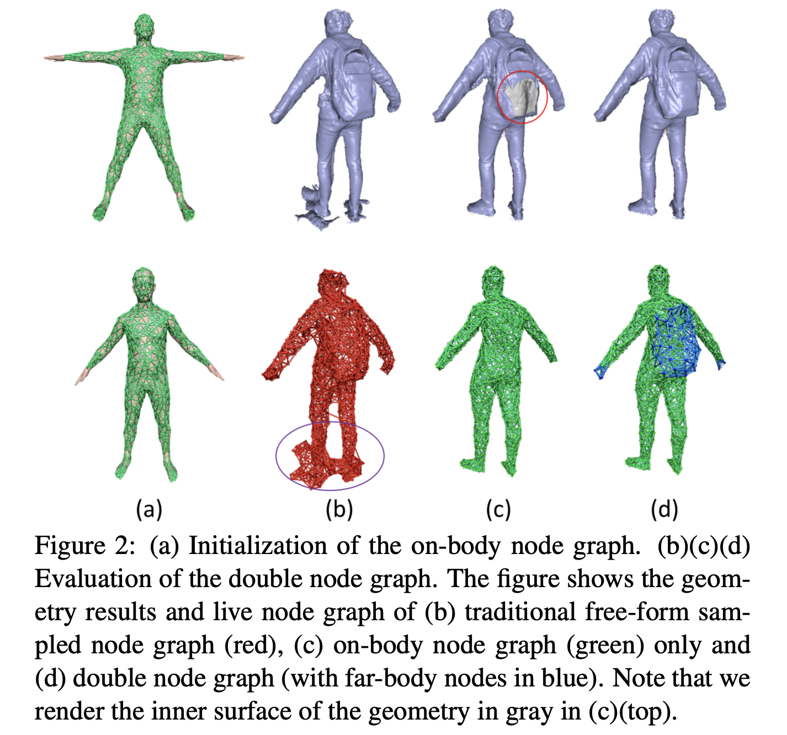

# Double Fusion

使用数据驱动模板拟合，从单帧深度相机帧中同时重建几何信息，非刚性动作和人体形状

主要贡献点：双层表示：身体形状参数和外表面融合

一个预定义身体表面的节点图参数化身体附近的形变，一个任意形状的动态变化图参数化远离身体外表面

基于双层表示的关节点动作追踪方法

## Introduction

类似 DynamicFusion等方法可以使用单一深度摄像头，在没有预先扫描模型模板的情况下实时动态重建。并且系统代价低，简单配置。但是这些任然受限于慢动作

由外在表皮层和内在身体层组成的双层表面表示来重建和深度匹配

### BodyFusion

使用骨骼正则化非刚体形变有利于捕捉人类行为。但是由于人类关节点太稀疏并且由于只使用渐变融合表皮来追踪，所以在动作较快的时候会跟踪失败。并且骨架嵌入表示严重依赖于初始化。不准确的骨架嵌入会导致追踪和动作形变的恶化

除了骨骼，身体形状也是很好的先验信息，所以我们提出了BodyFusion

1. 由外表面层 和 内在身体层用来重建和深度配置 组成的双层表面表示
2. 观察到的外表面逐渐融合和形变，内在身体层的形状和姿势参数同样逐渐优化匹配外表面

一方面：内在身体层是完整的模型允许找到足够的对应，特别是当只有空间表皮被获得的时候，附加的，这也限制了外表皮哪里做几何融合，

另一方面：逐渐融合的外表面提供了越来越多的约束来更新身体形状和姿势

## Related Work

人体动态几何重建方法分为三类：基于静态模板、基于模型、不限制的重建

### Static Template

对于动作捕捉而言：一些工作基于预先扫描的模板。因此表面重建的工作转变成了，动作追踪和表面形变的问题。

1. 基于多视角轮廓以及时空特征约束驱动的带有骨骼嵌入的模板方法
2. 处理多个互动表演者的方法
3. 随机森林预测对应的模板，然后用模板拟合深度数据
4. 相似表皮模型估计形状和姿势参数

除了带有骨骼嵌入的模板方法，还有一些工作使用基于非刚性表面形变的模板。

1. 利用嵌入形变图来参数化与扫描模板生成局部尽可能刚性的形变
2. $l_0$正则约束 在没有明确骨架嵌入情况下产生清晰的动作

### Model-based

基于模型的有：SCAPE、SMPL、Dyna模型

SCAPE：对形变因式分解成姿势和形状分量

SMPL：在有效的线性空间里表示形状和姿势形变

Dyna：学习一个低维子空间来表示软织物形变

一些工作使用形状先验来增强更通用的约束来捕获动态肢体

### Free-form

不使用任何几何先验，为了融合可见部分到完整的几何中，算法需要估计非刚性动作的准确性

同样需要准确的几何来估计准确的动作

1. 线性方差形变(linear variational deformation)
2. 形变图(deformation graph)
3. 子空间形变(subspace deformation)
4. 结构形变(articulate deformation)
5. 4D时空表面（4D spatio-temporas surface）
6. 不可压缩流（incompressible flows）
7. 动画制图 (animation cartography)
8. 准刚性运动 （quasi-rigid motions）
9. 方向场（and directional field）

## Overview

### Surface Representation

输入深度流信息，输出的是目标人的双层表（double-layer）面

Outer layer：可观察的表面区域，例如衣服可见的肢体（脸，头发）

Inner layer：基于SMPL的人体形状和骨骼模型

与【28-Dynamicfusion】工作相似，**外层表皮的动作参数化成了一个点集合**，每个节点根据刚性形变变形。**节点图**（node graph）内连了节点并约束她们进行相似的变形

我们在SMPL模型上预定义一个on-body 节点图，这个节点图提供了语义和真实先验信息来约束非刚性动作。可以防止错误的身体part连接。

### 双节点图构造

**我们在SMPL的均值模型统一采样节点并使用geodesic distance 构造预定义的on-body 节点图**

On-body节点固定的绑定在SMPL骨骼关节点上。

接近身体内部的Outer surface 区域同样绑定在on-body节点图上

远离身体的形变不能准确的被on-body图所表示，所以我们附加的用$\delta = 5 cm$半径在**新融合（原始点云和被姿态估计出的姿态所调整的SMPL模型进行的融合，算法ICP?）**的far-body几何上采样了far-body节点：距离on-body点距离超过$1.4 \times \delta cm$的顶点标记为far-body

#### geodesic distance

测地距离就是测量地表两点之间最短路径的距离，平均测地距离(Average geodesic distance)作为三维几何特征时，可以用来衡量模型点与模型中心的偏离程度

欧氏距离：如下图的$d_{15}$

测地距离：作为实际路径的最短距离，其距离应为沿途实线段距离之和的最小值 : $d_{12} + d_{23}+d_{34}+d_{45}$

平局测地距离就是 任取一个点，计算其他点距离该点距离的平均值，在该点越接近模型中心的情况下，该平均值会越小。

测地距离的关键就是获取两点之间的最短距离，所以实现算法一般可以使用**Dijkstra's algorithm**

[几何特征系列：Average Geodesic Distance（平均测地距离）](http://lemonc.me/average-geodesic-distance.html)

### Inner Body Model:SMPL

高效的线性身体模型，24个关节点，6890个顶点，每个关节点有3个自由度的旋转角。包括全局的root关节所以一共有$3 \times 24 +3 = 75$个姿势参数。

模型$T$的形变公式可以表示成：
$$
T(\beta,\theta) = \hat T + B_s(\beta) + B_p(\theta)
$$
$\beta$为形状参数

$\theta$为姿势参数

$B_s(\beta),B_p(\theta)$为顶点的偏移向量，分别代表shape的混合型状和pose的混合型状

姿势身体模型用公式表示为：
$$
M(\beta,\theta) = W(T(\beta,\theta),J(\beta),\theta,\mathbf W)
$$
$W(\cdot)$是通用混合蒙皮方法

$T(\beta,\theta)$为被修改的身体形状

$\theta $姿势参数

$J(\beta)$关节点位置

$\mathbf W$皮肤权重

返回摆好了pose的顶点。

### Initialization

固定相机位置，并且视相机的移动为全局场景的刚性动作。

表演者以A-pose开始

第一帧将深度图映射到体里面，来初始化TSDF体素

然后使用形状姿势优化（shape-pose optimization）来估计初始的形状参数$\beta_0$和骨架$\theta_0$

用这个两个参数和标准SMPL模型构造on-body节点图

然后使用Marching cube方法提取三角面片。然后采样far-body节点图（用于参数化远离内在身体的非刚性新表）

[见构造双节点图](#双节点图构造)

初始化SMPL模型:a上

估计姿势参数和骨架参数后更新为：a下

在a下上提取on-body节点图

在原图d下上提取far-body节点图

### Main Pipelne

主要问题在于外表面不完整导致的模型拟合困难

解决方法就是连续更新形状和姿势

所以路线就是:joint motion tracking --> geometric fusion --> volumetric shape-pose optimization

#### Joint motion tracking

对于on-body节点，我们约束了非刚性形变以使得跟着骨骼动作。

far-body节点也同样被优化，但并不被骨骼约束

#### Geometric funsion

和【Dynamicfusion】工作类似，在一个参考体积里非刚性的整合了多帧的深度观测信息

参考[Real-time geometry, albedo and motion reconstruction using a single rgbd camera]做了明显的体素碰撞检测。

#### Volumetric shape-pose optimization

几何融合后，典范帧里面的表面标的完整，直接优化身体形状和姿势用过融合的SDF

## Joint Motion Tracking

两个参数化的动作追踪组件：

1. 骨架动作
2. 非刚性节点形变

参考工作[Bodyfusion]的绑定项，用来约束两个组件。不同的是我们只在on-body节点上执行来惩罚非铰链式的on-body节点运动

far-body节点的独立形变正则化后可以像同一个图结构中的其他节点一样移动

参考工作【 Keep it SMPL: Automatic estimation of 3D human pose and shape from a single image.】使用统计姿势先验来防止不自然的动作。

联合优化能量方程如下：
$$
E_{mot} = \lambda_{data}E_{data} + \lambda_{bind}E_{bind} + \lambda_{reg}E_{reg}+\lambda_{pri}E_{pri}
$$

### Data Term

数据项用来测量重建的双层表皮和深度图之间的拟合程度
$$
E_{data} = \sum_{(v_c,u) \in P} \tau_1(\mathbf v_c) * \psi(\widetilde n_{v_c}^T (\widetilde {\mathbf v}_c - u)) + (\tau_2(\mathbf v_c) + \tau_3(\mathbf v_c)) * \psi(\widehat n_{v_c}^T (\widehat {\mathbf v}_c - u))
$$
$P$是信息集合

$\psi(\cdot)$是Geman-McClure 惩罚公式 鲁棒代价函数

$(\mathbf v_c,u)$ 是信息对，$u$是深度图上接近点$\mathbf v_c$的采样点，$\mathbf v_c$这个顶点既可以是身体形状也可以是融合表面

$\tau_1(\mathbf v_c),\tau_2(\mathbf v_c),\tau_3(\mathbf v_c)$分别对应指标：

当$\mathbf v_c$在融合表面上时 $\tau_1(\mathbf v_c) = 1$

当$\mathbf v_c$在身体形状上时 $\tau_2(\mathbf v_c) = 1$

当$\mathbf v_c$在融合表面上并且4nn（knn，k=4）节点都是on-body节点时 $\tau_3(\mathbf v_c) = 1$

$\widetilde n_{v_c}^T (\widetilde {\mathbf v}_c - u)$ 顶点到外表面的距离

$\widehat n_{v_c}^T (\widehat {\mathbf v}_c - u)$ 顶点到on-body表面的距离

$\widetilde {\mathbf v}_c,\widetilde {n}_{v_c}$分别是**顶点坐标**和被knn节点使用双四元数混合扭曲后的**法线**，定义如下
$$
T_(\mathbf v_c) = SE3(\sum _{k \in N(v_c)} w(k,v_c)dq_k)
$$
$dp_j$是第$j$个节点的双四元数

$SE3(\cdot)$是映射一个双四元数到一个$SE3$空间

$N(v_c)$表示$\mathbf v_c$节点附近点的集合

$w(k,v_c) = \exp(-||\mathbf v_c - x_k||_2^2/(2r_k^2))$是第$k$各节点对顶点$\mathbf v_c$的影响权重

这个公式可以看做是双四元数混合插值算法

**$\hat {\mathbf v}_c$是顶点坐标**

**$\hat n_{{\mathbf v}_c}$是使用LBS(线性混合蒙皮)在骨骼动作上计算的法线**
$$
G_(\mathbf v_c) = \sum_{i \in B} w_{i,v_c}G_i \\
G_i = \prod_{k \in k_i} \exp(\theta_k \hat \xi_k)
$$
$B$是骨骼的索引集合

$G_i$是第$i$个骨骼的级联刚性变形

$w_{i,v_c}$是联系第$i$个骨骼和点$\mathbf v_c$的蒙皮权重

$k_i$是后向传播链的第$i$个骨骼的父索引

$\exp(\theta_k \hat \xi_k)$是与$k$个骨骼的扭曲相关的指数映射

对于每个深度点$u$,在双层表面找到两个类型的对应，分别是$\mathbf v_t$在身体形状上的点和$\mathbf v_s$在融合表面上的点。选择其中一个最大化下面的欧几里得距离公式
$$
c = \arg max((1- {||\mathbf v_i - u||_2 \over \delta_{max}})^2 + \mu \widetilde {\mathbf n}_{v_i}^T{\mathbf n}_{u})
$$

#### SE(3)/se(3)

别称欧式变换，刚体变换。使用矩阵表示：
$$
\begin{bmatrix}
\mathbf R & t \\
0 & 1
\end{bmatrix}
$$
其中$\mathbf R$是旋转矩阵，$t$是平移向量

