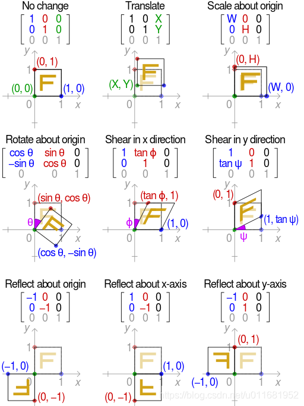
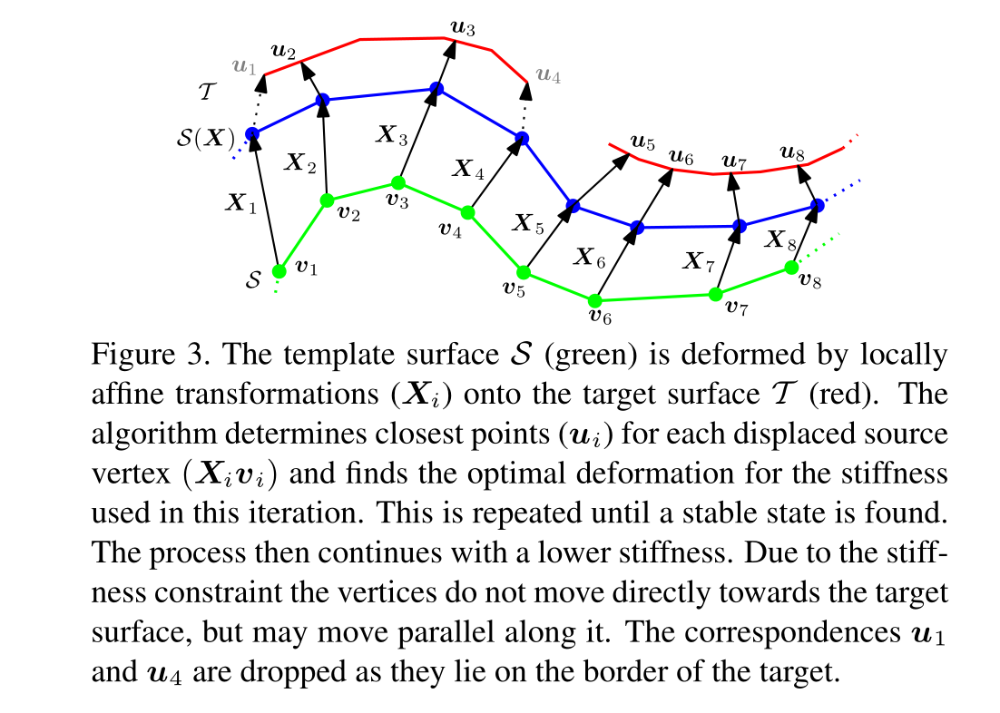

# NICP

使用局部仿射正则化的算法，对每个点指定一个仿射变换并且最小化相邻点变换中的差异（Difference）

## 仿射变换 (affine Transformation)

Reference : [Affine Transformation](https://blog.csdn.net/u011681952/article/details/98942207)

## introduction

配准两个表面意味着找到一个 描述模板表面和目标表面语义位置对应点 的匹配。这个可以表述成，模板表面扭曲到目标表面。为了从所有的可能形变中找到正确的形变。配准算法需要给形变添加约束。就是本文提到的**正则化**。

正则化：用基于相邻顶点mesh上的变形的不同最小化

对于所有点来说正确的匹配并不唯一。

密集配准：找到模板中每个点到目标的映射

稀疏方法：只找特定特征点的对应关系

为了从所有可能的配准中选择一个被配准变形场(Deformation field)所约束的可行形变。一个共同的方法就是使用通过最小化 梯度的平方范数 来平滑形变场。

## Method

给定一个$n$个顶点的集合$V$ 和$m$个边的集合$E$，构成一个模板$S = (V,E)$，目标表面$T$可以是任何形式，只要能计算出3D空间中的任意点的最近点。因此我们使用三角网格形式。

配准：找到一组参数描述可移动顶点$V(X)$，在配准后$V(X)$ 沿着形变模板的法线被投射到目标表面 给出最终的对应关系。

### Locally affine regularisation

确定扭曲的Cost Function和[1]中的定义相似。不同的是，非刚性ICP中的可以简化成固定对应，从而成为可以直接求解的二次函数

每个模板顶点的匹配候选参数是一个$3 \times 4$的仿射矩阵$X_i$ 

所以对所有顶点来说他的参数表示为 $X := [X_1,X_2,\ldots,X_n]^T$

**变形后的模板和目标之间的距离应该很小**，可以通过如下的Cost Function 来表示
$$
E_d(X) := \sum_{v_i \in V}w_i dist^2(T,X_iv_i) \tag 1
$$
$v_i = [x,y,z,1]^T$ 为模板顶点的齐次坐标系表示

点$v$和其在目标表面上的最近点的距离记为$dist(T,v)$。使用分层边界球结构(hierarchical bounding spheres structure)可以加速到$O(log_2t)$

$w_i$为匹配的置信权重。当没有对应顶点的时候该权重为0，对于其他情况权重为1

**全局衡量点进行形变之后距离平面距离应该很近**

附加刚性项被用来规范形变，我们使用F范数$||\cdot||_F$ 和权重矩阵$G := diag(1,1,1,\gamma)$来惩罚临近顶点之间变形权重的不同
$$
E_s(X) := \sum_{\{i,j\} \in set} ||(X_i - X_j)G||_F^2 \tag 2
$$
$\gamma$ 用来给旋转，倾斜，平移部分进行加权。$\gamma$的取值依赖于数据单位和形变类型

**用来衡量临近点的形变差别，相同区域内的临近点的形变不应该很大**

三个参数就可以描述一个顶点的移动，但是我们使用了12个参数，这样可以写成一个平方函数。构建一个最小化求解，三个参数的CostFunction的正则项 会导致不能直接求解、

Landmark损失：

给定一组landmarks 集合 $L = \{(v_{i_1},l_1),(v_{i_2},l_2),\ldots(v_{i_l},l_l)\}$配准模板顶点映射到目标表面，损失定义为：
$$
E_l(X) := \sum_{(v_i,l) \in L} ||X_iv_i - l||^2 \tag 3
$$
没有地标，模板会折叠成目标表面的一个点。

整体的CostFunction
$$
E(X) := E_d(X) + \alpha E_s(X)+ \beta E_l(X) \tag 4
$$

## Nonrigid optimal

- 初始化$X^0$
- 对于每个刚体 $\alpha^i \in \{\alpha^1,\alpha^2,\ldots,\alpha^n\} \ \alpha^i \gt \alpha^{i+1}$，由大到小试值
  - $||X^j - X^{j-1}|| \lt \Delta$
    - 找到对$V(X^{j-1})$ 的初步对应关系(形变参数) 
    - 确定$X^j$作为最优形变关系参数

外循环进行刚性权重的试值，从大到小，表示随着循环，刚性变形的权重越来越小。从全局刚性配准到局部的刚性配准

内循环在外循环选定刚性权重的情况下，

1. 通过最近点搜索找到初步的对应(形变参数)。
2. 然后通过对应关系以及刚性权重确定模板的最优形变。
3. 通过这个最优性变会得到新的模板位置。
4. 这组新的模板位置再和目标产生一组新的对应关系，
5. 新的对应关系参与下一次的迭代，直到迭代收敛，然后降低刚度权重

参考图三的变化：目标：S通过局部仿射变换移动到T上

1. 在固定的刚性系数$\alpha$下对每个仿射变换后的点$(X_iv_i)$确定最近点$u_i$
2. 重复直到每个点都稳定
3. 降低刚性系数 重复该过程
4. 当点在边界上的时候进行丢弃 $u_1,u_4$

## 数学推导

#### 张量积

$$
X \otimes Y = 
\begin{pmatrix}
x_{11}Y & x_{12}Y & \ldots & x_{1n}Y \\
x_{21}Y & x_{22}Y & \ldots & x_{2n}Y \\
\vdots & \vdots & \ldots & \vdots \\
x_{m1}Y & x_{m2}Y & \ldots & x_{mn}Y
\end{pmatrix}
$$

如果$X = m \times n 、Y = p \times q$

那么有$X \otimes Y = mp \times nq$

当模板和目标一一对应的时候，CostFunction是可以最小化求解的函数。我们使用矩阵形式重写等式$(4)$

### 1. Distance Term

$$
E_d(X) := \sum_{v_i \in V} w_i||X_iv_i-u_i||^2 = 
\begin{Vmatrix}
(W \otimes I_3)
(
\begin{bmatrix}
X_1 & & \\
& \ddots &\\
& & X_n\\
\end{bmatrix}
\begin{bmatrix}
v_1\\
\vdots \\
v_n \\
\end{bmatrix}
-
\begin{bmatrix}
u_1\\
\vdots \\
u_n \\
\end{bmatrix}
)
\end{Vmatrix}^2
$$

其中 
$$
W \otimes I_3 = \begin{bmatrix}
\mathbf w_1 & &\\
& \ddots & \\
&& \mathbf w_n \\
\end{bmatrix},
\mathbf w_i = \begin{bmatrix}
w_i & 0 & 0 \\
0 & w_i & 0 \\
0 & 0 & w_i \\
\end{bmatrix}
$$
$W \otimes I_3$是一个分块矩阵，每个元素都是一个$3 \times 3$的单位矩阵与$w_i$的乘积 
$$
X_i = 
\begin{bmatrix}
r_{00} & r_{01} & r_{02} & t_0 \\
r_{10} & r_{11} & r_{12} & t_1 \\
r_{20} & r_{21} & r_{22} & t_0 \\
\end{bmatrix}
\begin{bmatrix}
x_1 \\ y_1 \\  z_1 \\ 1
\end{bmatrix}
= 
\begin{bmatrix}
x_1 & y_1& z_1 & 1
\end{bmatrix}
\begin{bmatrix}
r_{00} & r_{10} & r_{20} \\
r_{01} & r_{11} & r_{22} \\
r_{02} & r_{12} & r_{22} \\
t_0 & t_1 & t_2
\end{bmatrix}
= v_i^T\begin{bmatrix}R & T\end{bmatrix}^T = v_i^TX_i
$$
重写为：
$$
D = 
\begin{bmatrix}
[x_1,y_1,z_1,1]\\
&[x_2,y_2,z_2,1]\\
&&\ddots\\
&&&&[x_n,y_n,z_n,1]\\
\end{bmatrix} = 
\begin{bmatrix}
v_1^T \\
& v_2^T \\
&& \ddots\\
&&& v_n^T
\end{bmatrix}
$$

$$
E_d(X) = ||W(DX-U)||_F^2
$$
$W = n \times n$

$D = n \times 4n$

$X = 4n \times 3$

$U =[u_1,\ldots,u_n]^T = n \times 3$

### 2. Stiffness term

使用 node-arc incidence matrix 节点弧关联矩阵$M$表示节点和弧的关系

这个矩阵为有向图的表示，每行表示一个弧（边）每一列表示一个节点（顶点）
$$
\begin{array}{c|c|c}
n & v_1 & v_2 & v_3 & v_4 & \ldots & v_n \\
\hline
r_1 & -1 & 1 & 0 & 0 & \ldots & 0\\
r_2 \\
\vdots \\
r_m \\
\end{array}
$$
例如$r_1$为顶点$(1,2)$之间的弧，那么$M_{ri} = -1,M_{r_j} = 1$

那么第二项就可以写成如下形式：
$$
G = \begin{bmatrix}
1&&& \\
&1&& \\
&&1& \\
&&& \gamma \\
\end{bmatrix}\rightarrow E_s(X) = ||(M \otimes G)X||_F^2
$$
如果有$n$个顶点$m$条边的话那么就有

$M = m \times n$

$G = 4 \times 4$

$X = 4n \times 3$

$M \otimes G = 4m \times 4n$

### 3. Landmark Term

从$D$矩阵中拿出对应的landmark顶点，记为$D_L = L \times 4L$。使用$U_L = [l_1,\dots,l_l]^T$记为对应

重写为：
$$
E_l(X) = ||D_LX - U_L||_F^2
$$

### Complete

合并这三项可以得到CostFunction
$$
E(X) = 
\begin{Vmatrix}
\begin{bmatrix}
\alpha M \otimes G \\
WD\\
\beta D_L
\end{bmatrix}
X-
\begin{bmatrix}
0 \\
WU \\
U_L
\end{bmatrix}
\end{Vmatrix}_F^2 
记为
||AX-B||_F^2
$$
更具求导后等于0可以计算出$X$的极值点
$$
E'(X) = A^TAX - A^TB = 0 \\
X = (A^TA)^{-1}A^TB
$$
$X = (A^TA)^{-1}A^TB$，即为我们最优解所在点

注意：

$M \otimes G = 4m \times 4n$

$WD = n \times 4n$

$D_L = L \times 4L$

$X = 4n \times 3$

如果$A$并不是满秩，那么注意到$(A^TA)$是不可逆的。这个方程就无解

对于矩阵$A$的所有子矩阵$M \otimes G、WD、D_L$都不是满秩。

唯一足够多的行就是$M \otimes G$ 。$M$可能会有$(n-1) \times n$，那么$M \otimes G = 4(n-1) \times 4n$秩最多有$4n-4$

### 求解分析

本节主要证明，$r(A) = 4n$，$A^TA$可逆。证明忽略了第三项landmark项，这项并不影响结果
$$
矩阵的上半区域\\
\begin{array}{c|c|c|c}
n & v_i & v_i &v_i & v_i & \cdots & v_j & v_j & v_j & v_j\\
\hline
\vdots \\
\hline
r & 1 &&&&& -1\\
\hline
r && 1 &&&&& -1\\
\hline
r &&& 1 &&&&& -1\\
\hline
r &&&& \gamma &&&&& -\gamma\\
\hline
\vdots \\
\hline
\end{array}\\
矩阵的下半区域\\
\begin{array}{c|c|c|c}
n & 4i-3 & 4i-2 &4i-1 & 4i & \cdots & 4j-3 & 4j-2 & 4j-1 & 4j\\
\hline
\vdots \\
\hline
i & x_i & y_i & z_i & 1 &\cdots & 0 & 0 & 0 & 0\\
\hline
\vdots \\
\hline
j & 0 & 0 & 0 & 0 &\cdots & x_j & y_j & z_j & 1\\
\end{array}\\
$$

$$
A = \begin{bmatrix}
\alpha M_1 \otimes G & \alpha M_2 \otimes G & \ldots & \alpha M_n \otimes G \\
v_1^T &&& \\
& v_2^T && \\
&& \ddots& \\
&&& v_n^T \\
\end{bmatrix} = [A_1 | \ldots|A_n]
$$
$A_i^p$记为第$i$块第$p$列的元素
$$
A_i = [A_i^1 | A_i^2 | A_i^3 | A_i^4]
$$
假设：如果A不满秩那么可以找到一组非零系数$a$使得
$$
合并行：\sum_p \sum_i a_i^pA_i^p = \sum_p (a_1^p A_1^p + a_2^p A_2^p +\dots + a_n^p A_n^p ) =  0 \tag 6
$$
**对于矩阵$A$的上半区域[m = n-1条边n个顶点$(4m \times 4n)$]**是由节点弧矩阵内克积一个对角阵得到并且缩放$\alpha$倍。因此对于第$r$条边有对应的行号为$[4(r-1) + 1,4(r-1)+2,4(r-1)+3,4(r-1)+4]$。记为$4(r-1)+p,p \in [1,2,3,4]$

设第$r$条边连接节点$i,j$的话

那么对应的列有$4(i-1)+p、4(j-1)+p$不为0

这两组列的值，仅在符号上不一样，对于连接边为$i\rightarrow j$的情况有：$M_i = 1 ，M_j = -1$。所以有这两组列分别对应$-D,D$矩阵

更具M矩阵的每一行的性质，顶点$i \rightarrow j$有
$$
\begin{cases}
M_{ri} = 1,M_{rj} = -1  & i连接到j\\
M_{rx} = 0 & x \ne [i,j]
\end{cases}
$$
所以这一行的系数刚好构成一串不全为0的系数$[0_1,0_2,\ldots,1_i,\ldots,-1_j,\ldots,0_n]$

也就是说$A_i^p$列的系数$a_i^p$是等同于 顶点$j$连接到顶点$i$的系数的$a_j^p$的
$$
\sum_p \sum_i a_i^pA_i^p = \sum_pa^p \sum_i A_i^p \tag 7
$$

**对于矩阵$A$的下半区域[n \times 4n]** 第$4n+i$行表示着顶点$i$的实体，该行中对应的顶点所在列同样为$4(i-1)+p、p \in [1,2,3,4]$ （因为每4个元素为一个顶点$[x,y,z,1]$）

所以对于顶点$i$，在下半区域。在矩阵$A$的中只有第$(4n+i)$行$(4(i-1)+p \ 且 \  p \in [1,2,3,4])$列不为0，该行其余都为0

所以说你要抵消这个元素，需要有顶点和他在同一行或者同一列

给每个顶点施加一个系数约束
$$
v_i^t
\begin{bmatrix}
a^1 \\
a^2 \\
a^3 \\
a^4\\
\end{bmatrix} = 
\begin{bmatrix}
x_i & y_i & z_i &1
\end{bmatrix}
\begin{bmatrix}
a^1 \\
a^2 \\
a^3 \\
a^4\\
\end{bmatrix} = 0
$$
推出有
$$
\begin{bmatrix}
v_1^T \\
\vdots \\
v_n^T\\
\end{bmatrix}
\begin{bmatrix}
a^1 \\
a^2 \\
a^3 \\
a^4\\
\end{bmatrix} = \mathbf0
$$
这个方程式超定的，除非$[a^1,a^2,a^3,a^4]$都为0，与假设矛盾

所以，可以知道矩阵$A$有全列秩，海森矩阵$A^TA$是可逆的

## Missing data

对于等式2，设置权重为0来处理缺失的数据。
