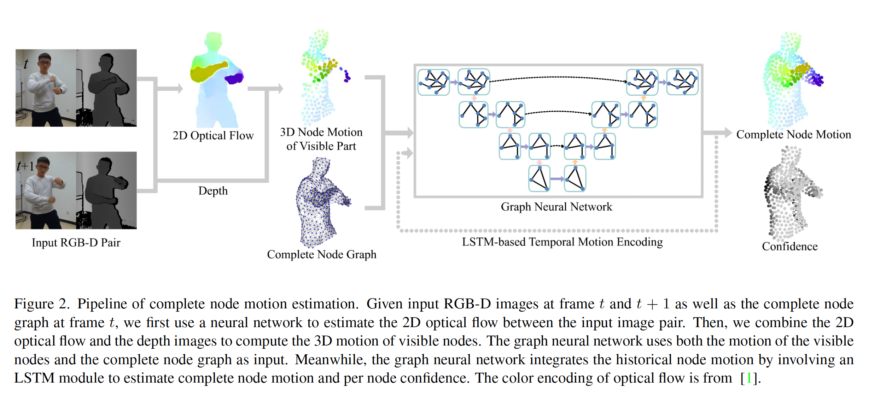
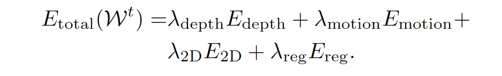

# Occlusion Fusion

## Abstract

使用图像中可见部分结合时间信息估计不可见区域，使用LSTM-involed 图神经网络

对输出建立概率模型计算动作的置信度。

## Introduction

Online：iterative geometry fitting ,sparse image feature matching,photometric constrains。实时的方法并不能得可信赖的模板，并且随着时间推移误差会进行累计。导致在长序列上和具有挑战性的动作上准确度受限

Offline：并不用考虑计算复杂度，缺点就是不实时

OcclusionFusion:结合了两者的优势，通过探索时间和空间的动作先验达到了更好的效果，可见区域和历史动作信息可以作为强力的先验信息，来限制被遮挡部分的动作估计。

我们使用一种图神经网络，这个图神经网络整合了可见区域的图结构信息和LSTM的历史信息

## Method

1. 对于给定的RGBD图像和当前重建模型的节点图。首先通过网络估计先前帧和当前帧的2D视觉流信息。
2. 然后更具视觉流信息和深度信息计算可见区域的3D动作信息
3. 3D动作信息和完整的图节点信息送入图神经网络
4. 加入LSTM模块生成历史信息
5. 最后图网络回归所有节点的动作和置信度

### 图节点的表示

参考 Embedded deformation for shape manipulation【37】.

图节点统一从目标表面采样得到，为了解决被遮挡的图节点的动作，用图神经网络提出了一个感知遮挡的动作估计器

### 网络结构

网路输入的是完整的图结构，可见区域的图结构的动作信息以及历史信息

输入的图特征是包含了节点的3D位置信息和动作信息(节点可见)，节点不可见的情况动作信息置为0

除此之外还加了一个可见维度，0表示不可见，1表示可见

单帧信息并不足够重建所有节点动作信息，因此引入了LSTM。我们为每个节点通过LSTM维护了一个节点状态，LSTM用历史信息和置信度来估计当前帧节点的动作和置信度

为了建模3D节点和置信度，我们使用高斯分布和协方差进行建模$N(\mu,\delta^2 I)$.$\mu$是预测的3D运动，$\delta$是置信度的标准差

### 置信度引导的重建

使用TSDF保存canonical model

使用Embedded deformation for shape manipulation【37】 中提出来的基于图的表示方法，参数化非刚性动作。

节点可以被形变图表示$G = \{ [p_i,T_i]\}$，$p_i$表示节点所在3D位置，$T_i$表示第$i$个节点的变形

给定重建模型$M^{t-1}$,输入的RGBD数据对$\{C^{t-1},D^{t-1}\},\{C^{t},D^{t}\}$

优化如下函数来求解$W^t$

