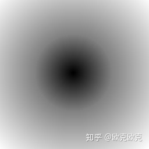

# TSDF(truncated singed distance function)

## SDF(Singed distance function)

有向距离场：物体表面最近距离的采样网络，负值表示物体内部，使用正值表示物体外部。

每个像素或者体素，记录距离自己最近物体之间的距离

1. 在物体上，距离为0
2. 在物体内，距离为负值
3. 在物体外，距离为正值

左图：白色的表示物体

右图：SDF图，值映射到$[0,1]$

    
      
   

### 计算SDF的算法

1. 暴力求解 时间复杂度为 $O(w \times h)$
2. 8ssedt

### 8ssedt算法

对于任意一个像素点存在两种情况:

1. 像素点在目标上，所以距离为0
2. 像素点不在目标上，目标点在四周

计算像素点与目标之间的距离使用**欧氏距离**
$$
\begin{array}{c|c|c}
\hline
\sqrt 2 & 1 & \sqrt 2 \\
\hline
1 & 0 & 1 \\
\hline
\sqrt 2 & 1 & \sqrt 2 \\
\hline
\end{array}
$$

对于第二种情况，根据动态规划：我们考虑距离像素点最近的某个像素（上、下、左、右、左上、左下、右上、右下）可以得到最近像素点状态转移方程：
$$
MinSDF = (near.sdf + distance(now,near))
$$
$near$ 附近点，$now$当前点，$near.sdf$当前点的附近点的SDF值

附近点的sdf值+当前点与附近点的距离最小的点，即为当前点的最小sdf值

所以整理上诉步骤可得：

1. 8ssedt首先遍历一边图像，将物体内和物体外的点标记出来
2. 分别计算物体外到物体的距离($sdf_1$)、以及物体内部的点到物体外的距离($sdf_2$)
3. 上诉计算两个距离矩阵之后，前者一般视为正值，后者一般视为负值

更具计算特性：当我们遍历图的时候，更具遍历的方向是无法知道当前点是距离遍历起始点最近（下表中的左上角点），还是遍历方向往后的点距离最近(下表中的右下角点)
$$
\begin{array}{c|c|c|c|c}
\hline
sdf_{00} & sdf_{01} & sdf_{02} & sdf_{03} & sdf_{04} \\
\hline
sdf_{10} & sdf_{11} & sdf_{12} & sdf_{13} & sdf_{14} \\
\hline
sdf_{20} & sdf_{21} & sdf_{22} & cal(sdf(23)) & - \\
\hline
- & - & - & - & - \\
\hline
- & - & - & - & - \\
\hline
\end{array}
$$

对于$cal(sdf(23))$点的SDF值时，他的左，左上，上，右上均是已知。右、左下，下，右下均是未知。

因此我们可以两个方向的迭代计算，分别从左上角点往右下角点计算和从右下角点往左上角点计算
$$
\begin{array}{c|c|c|c|c}
\hline
- & - & - & - & - \\
\hline
- & - & - & - & - \\
\hline
- & - & - & cal(sdf(23)) & sdf_{24} \\
\hline
sdf_{30} & sdf_{31} & sdf_{32} & sdf_{33} & sdf_{34} \\
\hline
sdf_{40} & sdf_{41} & sdf_{42} & sdf_{43} & sdf_{44} \\
\hline
\end{array}
$$
结合这两个计算图，既可以得到SDF图

我们更具上诉的方法计算，物体外部点到物体内部点的$sdf_1$、物体内到物体外的$sdf_2$。这里得到的两个都是距离标量，并不包含方向。所以对这两个图做减法既可以得到带符号的矢量SDF图
$$
sdf_{image} = sdf_1 - sdf_2
$$

### Reference: 

[Signed Distance Field 原理](https://zhuanlan.zhihu.com/p/337944099)

[Signed Fistance Fields 代码](http://www.codersnotes.com/notes/signed-distance-fields/)

[Signed Distance Fields 代码优化 C++](https://www.jianshu.com/p/58271568781d)

## TSDF （truncated singed distance fucntion）

TSDF 是在SDF上的改进

更具SDF的思想并拓展到3D空间中，TSDF计算空间中的每个体素到真实平面的最短带符号距离。构成一个距离的三维矩阵。
$$
d(x) = d_s- d_v
$$
$d_s$为真实平面到相机的距离，$d_v$为测量出来的深度。

$d(x) \lt 0$说明该空间点在表面后面，$d(x) \gt 0$ 说明在表面前面，$d(x) = 0$在表面上

我们假设一个先验：相机测得的距离远离平面，这个概率是较低的
$$
d(x) = |d_s - d_v| > \delta
$$
因此设立一个阈值$\delta$，只考虑$|d(x)| \le \delta$这个范围内的体素(截断)，并对这个体素进行计算和更新。

### TSDF 算法步骤

1. 初始化
2. 计算当前帧的TSDF值以及权重
3. 当前帧与全局融合

#### 1.初始化

建立包含物体的空间体，并等分成$n \times n \times n$个网格。然后构造体素坐标与真实坐标系下点云坐标之间的映射关系

对于一个$(x,y,z),x \in (0,X),y \in (0,Y),z \in (0,Z) $的点云集合。

每个GPU计算一个晶格体$(x_i,y_j),i \in (0,X),j \in (0,Y) $

#### 2.计算TSDF值以及权重

##### 2.1 坐标系转换

###### 2.1.1像素坐标系转化为相机坐标系

**Reference:** [世界坐标系，相机坐标系，图像坐标系，像素坐标系的转换](https://zhuanlan.zhihu.com/p/282497081)

假设一个像素坐标$(x,y,z)$，像素坐标与相机坐标系的转换公式

更具成像原理：

$(o',x',y')$坐标系为图像坐标系 

$(X_c,Y_c,Z_c)$为相机坐标系

$P$点相机坐标为$(X_p,Y_p,Z_p)$、$p'$图像坐标为$(x_p',y_p',z_p')$

两三角形相似：$\Delta PO_cZ_c \sim \Delta O'P'O_c $ 可得
$$
{Z_p \over f} = {X_p \over x_p'} = {Y_p \over y_p'}
$$
写成矩阵形式：
$$
Z_p
\begin{pmatrix}
x_p' \\
y_p' \\
1 \\
\end{pmatrix}
=
\begin{pmatrix}
f & 0 & 0 & 0 \\
0 & f & 0 & 0 \\
0 & 0 & 1 & 0 \\
\end{pmatrix}
\begin{pmatrix}
X_p \\
Y_p \\
Z_p \\
1 \\ 
\end{pmatrix}
$$

###### 2.1.2图像坐标系转换到像素坐标系

因为像素的单位和图像坐标系的单位并不统一，图像坐标系单位为mm，像素坐标系为第几个像素

并且坐标原点也不统一，图像坐标系的原点为中心，而像素坐标系一般为左上角。如下图

$O_0$为像素坐标原点，$O_1$为图像坐标系原点

所以对与上式中的$f(u,v) = f(x/dx + u_0 ,y/dy + v_0)$

其中dx,dy为别为每个像素在横轴和纵轴的长度

$u_0,v_0$是像素坐标系的偏移向量，即$\overrightarrow {O_0O_1}$

所以将相机坐标系一步转换到像素坐标系，该矩阵转换成如下形式
$$
Z_p
\begin{pmatrix}
u \\
v \\
1 \\
\end{pmatrix}
= 
Z_p
\begin{pmatrix}
{1 \over dx} & 0 & u_0 \\
0 & {1 \over dx} & v_0 \\
0 & 0 & 1 \\
\end{pmatrix}
\begin{pmatrix}
x_p' \\
y_p' \\
1 \\
\end{pmatrix}
=
Z_p
\begin{pmatrix}
{1 \over dx} & 0 & u_0 \\
0 & {1 \over dx} & v_0 \\
0 & 0 & 1 \\
\end{pmatrix}
\begin{pmatrix}
f & 0 & 0 & 0 \\
0 & f & 0 & 0 \\
0 & 0 & 1 & 0 \\
\end{pmatrix}
\begin{pmatrix}
X_p \\
Y_p \\
Z_p \\
1 \\ 
\end{pmatrix} \rightarrow
$$
整理得：
$$
\begin{pmatrix}
u \\
v \\
1 \\
\end{pmatrix} = 
\begin{pmatrix}
{f \over dx} & 0 & u_0 & 0 \\
0 & {f \over dy} & v_0 & 0 \\
0 & 0 & 1 & 0 \\
\end{pmatrix}
\begin{pmatrix}
X_p \\
Y_p \\
Z_p \\
1 \\ 
\end{pmatrix} = M_{in} 
\begin{pmatrix}
X_p \\
Y_p \\
Z_p \\
1 \\ 
\end{pmatrix}
$$
$M_{in}$就是**内参矩阵**

###### 2.1.3 相机坐标系转换为世界坐标系

对于世界坐标系的一点$(X_r,Y_r,Z_r)$，与相机坐标系$(X_p,Y_p,Z_o)$可以看成是一个线性映射。坐标系原点不一，但是空间度量一致

只需要找到旋转矩阵$R$和平移矩阵$t$，可以将世界坐标系转换成相机坐标系
$$
\begin{pmatrix}
X_p \\
Y_p \\
Z_p \\
\end{pmatrix} = 
R \begin{pmatrix}
X_r \\
Y_r \\
Z_r \\
\end{pmatrix} + T = 
\begin{pmatrix}
R & T \\
0 & 1 \\
\end{pmatrix}
\begin{pmatrix}
X_r \\
Y_r \\
Z_r \\
1 \\
\end{pmatrix} = M_{out} 
\begin{pmatrix}
X_r \\
Y_r \\
Z_r \\
1 \\
\end{pmatrix}
$$
其中$M_{out}$为**相机外参矩阵**

###### 2.1.3.1旋转矩阵R

可以描述成旋转向量、欧拉角、四元数、旋转矩阵

###### 欧拉角

描述坐标系分别绕三轴旋转多少度

内旋：绕自身轴旋转

外旋：绕外在固定轴旋转

###### 旋转矩阵

假设分别绕XYZ轴旋转$\alpha、\beta 、\gamma$度。更具轴变换可以写成矩阵形式
$$
R_x(\alpha) = 
\begin{bmatrix}
1 & 0 & 0 \\
0 & cos \alpha & -sin \alpha \\
0 & sin \alpha & cos \alpha \\
\end{bmatrix}，
R_y(\beta) = 
\begin{bmatrix}
\cos \beta & 0 & \sin \beta \\
0 & 1 & 0 \\
-\sin \beta & 0 & \cos \beta \\
\end{bmatrix}，
R_z(\gamma) = 
\begin{bmatrix}
\cos \gamma & -\sin \gamma  & 0\\
\sin \gamma & \cos \gamma & 0 \\
0 & 0 & 1 \\
\end{bmatrix}，
$$
X-Y-Z旋转方式的旋转矩阵 = $R_x(\alpha) * R_y(\beta) * R_z(\gamma)$ ，更具旋转顺序的不同，矩阵乘法的元素顺序也不同

###### 四元数

参考 [四元数——基本概念](https://zhuanlan.zhihu.com/p/27471300)

##### 2.2 TSDF 值计算

对于体素中心点$x$ 有
$$
sdf(x) = depth_i(pic(x)) - cam_z(x)
$$
其中$pic(x)$为体素中心对应到深度图片的映射，

$depth_i(pic(x))$为相机与体素的射线到达最近平面的测量深度（深度值）

$cam_z(x)$ 是体素与相机沿光射线的距离，每个体素到相机的距离在体素建立好之后是固定的

$sdf(x)$ 同样也是光轴上的距离

计算体素$x$的tsdf值：
$$
tsdf(x) = \max(-1,min(1,{sdf(x) \over t}))
$$
其中$t$为截断阈值，所以更具上式可以变形如下形式：
$$
tsdf(x) = 
\begin{cases}
{sdf(x) \over t} &, if & -t \lt sdf(x) \lt t \\
1 &, if & sdf(x) \ge t \\
-1 &, if & sdf(x) \le -t
\end{cases}
$$
最后得到二维结果如下图：

更具上述的操作，多次观察的结果可以整合到一个TSDF帧中，通过这个可以整合不同视角来提高准确率并补充表面损失的地方。

整合的操作就是通过加权和，以及迭代更新TSDF帧来进行

权重计算：对于不同帧对同一个体素进行观察更新，需要更具不同帧的测量角度来加权不同帧。

一般而言深度相机和目标夹角 $\theta$越小，那么观测到的越准确，因此定义帧的权重信息：
$$
w(p) = {\cos(\theta) \over distance(v) }
$$

##### 2.3 当前帧与全局融合

第$i$帧的TSDF 表示为$tsdf_i$ 权重表示为$w_i$

全局的TSDF 表示为 $TSDF_{i-1} $ 权重表示为 $W_{i-1}$

那么全局TSDF更新公式如下：
$$
TSDF_i = {W_{i-1} TSDF_{i-1} + w_i tsdf_i \over W_{i-1} + w_i}
$$

$$
W_i = W_{i-1} + w_i
$$

反复执行既可以将新帧融合到之前的帧上

对于大多数方法设置体素权重$w_i = 1$，相机之外的体素设为0

### 算法参数

#### 网格大小(Grid volume size)

网格大小决定了TSDF网格的维度，这个值取决的GPU内存的上限。网格越大内存占用也越大

#### 体素大小(Voxel size)

体素越大，同等维度的3D网格，网格数越少，占用的内存也就越少，计算量也会越少。但是重建的精度也会下降

#### 距离表示和阶段距离

量化误差与$t$成正比，$t$越小越好，并且$t$ 应该大于体素对角长度$\sqrt d \cdot v$和噪音级别

## Reference

[3D Reconstruction——TSDF volume reconstruction](https://wlsdzyzl.top/2019/01/25/3D-Reconstruction%E2%80%94%E2%80%94TSDF-volume-reconstruction/)

## Marching Cube

等值面提取
