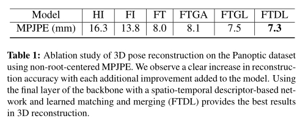

# TesseTrack

## Introduction

**一种在公共体素化特征空间运行的新时空公式**，通过将每帧深度学习的特征转化成离散的3D体素容积

1. 3D CNN定位在体素容积内的每个人的位置
2. 对每个人用一个4D CNN计算短期人的特定表示，生成一个固定的时空容积。相邻时间步的重叠表示进一步被基于注意力的聚合所打分，并使用不同的匹配器来连接
3. 同一个人的3D 关节，以基于合并特定人的表示在每个时间步骤里连续一致的被预测

第二个贡献：**新颖的可学习跟踪公式**，可以将任意一个人的时空表示学习拓展到任意时间长的序列中

这个跟踪公式与文献[49] 使用匈牙利算法做姿势距离的匹配（启发式成对追踪）不一样。我们依赖的是基于 Sinkhorn 算法的注意力聚集层和可区分的表示匹配层。重要的是**我们匹配的是人的特征而不是身体姿态轨迹**。

## Related Work

单人三维姿态追踪可分为多视图和单视图的方法

## TesseTrack

网络由三个部分构成，每个部分都有相关联的损失

1. 第一个部分是在3D空间中人体的检测，然后通过4D CNN 提取每个人的短期时空表示
2. 解决时间$t $ 和 $ t+\Delta t$两帧之间描述符匹配的问题：
3. 将所有匹配的描述符反卷积到中间帧的人的3D姿态，那些重叠的描述符并且会合并成为一个描述符

## Block One (Person detection Network)

这个模块是一个多视角人物检测网络（multi-view person detection network--PDN）

BackBone: HRNet

使用网络的Pre-final层，通过一个卷积层转换成大小为$R$ 的特征图

然后所有视角的特征图通过逆图像映射方法聚集到3D空间上

使用相机校准数据，并每个体素中心都会被投影到相机视图。将图像空间中的所有特征向量$Concat$起来，通过一个带有$softmax$ 层的浅层网络来聚集这些特征向量。这样会生成一个唯一的尺寸为$R$的特征向量。最后得到一个$R \times W \times H \times D$维度的数据，$W,H,D$为体素空间的维度，然后在这个数据上应用3D卷积，来训练网络检测中心的能力，这个中心就是人体颈部和臀部的中心点。损失即为：预测热图和输出热图的距离。类似CenterNet方法。
$$
L_D^t = \sum_{w=1}^W\sum_{h=1}^H\sum_{d=1}^D||V_{Pred} - V_{GT}||
$$
并且在3D热图上应用非极大值抑制，保留分数较大的预测

## Block Two (Spatio-Temporal Descriptors and Tracking)

对于检测到的人创建一个固定维度的时空体，然后使用4D CNN在检测帧生成一个短期的表示，我们将该网络称之为$Tesseract$,维度为$R \times T \times X \times Y \times Z$，$T$为空间窗口大小，$X,Y,Z$为检测人的立方体的中心维度

扩充空间信息的目的有两个

1. 使用空间上下文可以更好的在中心帧估计关节点的位置
2. 及时生成人的描述信息可以生成与相邻帧重叠的描述符，这样可以通过相似性来进行追踪

### Tesseract

该网络的输入是：$HRNet$中将每个时间戳投射成3D的pre-final层

和Block One的过程相似。然后通过多头4D卷积核最大池化层，来生成降低尺寸的tesseract 特征。这些特征代表了以检测为中心人的时空描述符。这个描述符将会被用于跟踪和姿态估计

### Attention Aggregation

将特征送入GNN来整合上下文线索提高特征的显著性，我们使用两种边：

自边：连接属于同一时间实例的特征

交叉边：连接邻近时间实例的特征

${^{(l)}}x_i^t$表示元素$i$ 在时间$t$ 第$l$层的中间表示。

更具多头信息传递更新输入已得到最终的匹配描述符：
$$
f_i^t = W.{^{(l)}}x_i^t + b
$$

### Temporal Matching Layer

考虑在时间$t$和$t+\Delta t$的特征 $N$和$M$,在标准的二分图匹配中，最优**分配矩阵$P$**是一个可以时总分最大化的排列矩阵

这个总分就是：$\sum_{i,j}S_{i,j}P_{i,j}$

S是一个得分矩阵用来衡量 两个时间的描述符相似性的矩阵。$S \in R^{M \times N}$ 

时间$t$ 描述符为$i$

时间$t + \Delta t$ 描述符为 $j$
$$
S_{i,j} = <f_i^t,f_j^{(t+\Delta t)}>
$$
$S_{i,j}$为两时刻的内积

为了让网络能够抑制错误检测的目标，并处理场景中的人数变化，我们用dustBin增强每个集合，这样可以使匹配总是计算固定长度的特征向量。

使用 $Softassign$算法通过可微分算子来解决分配问题(目标匹配)。经过100次迭代后得到最终的得分矩阵$P$

由上面的模块是可微的，更具监督学习最小化分配矩阵$P$对数似然函数
$$
L_T^t = - \sum_{(i,j)\in G}logP_{i,j}
$$

## Block Three (3D Pose Estimation)

### Spatio-temporal descriptors merging

如果说$T$ 为tesseract的时间窗口大小，对一个人跟踪$T$帧后，我们得到$T$个时空描述符。这些描述符在全局时间内叠加，并且对时间段：$2T - 1$内的人的姿势和移动进行编码。

### Tesseract deconvolution

合并后并进行编码的特征向量，送入多头4D反卷积层，生成人在时间$t$处的关节3D热力图

用$T_{Pred}^q$表示关节$q$的热力图，关节位置$k_{Pred}^q$是热力图通过操作得[$soft-argmax$](https://www.cnblogs.com/xiongzihua/p/9527276.html)到，即通过对热力图进行加权平均和得到体素中心
$$
argmax \ E[x] = \sum_i {e^{x_i} \over \sum_j e^{x_j}}i
$$
一般而言，可以看做是对热力图进行归一化之后，对坐标的加权平均和。得到最大值点的坐标。为了提高最大值的影响，一般会扩充$\beta$倍。拉伸最大值和较小值的距离，这样可以更精确找到最大值坐标点
$$
soft-argmax \ E[x] = \sum_i {e^{\beta x_i} \over \sum_j e^{\beta x_j}}i
$$

我们联合两个损失作为姿态估计的损失：

1. 关键点位置的L1距离损失
2. 对应Ground Truth热力图关节点位置的损失

$$
L_P^{t,d} = \sum_{q=1}^Q[||k_{pred}^q - k_{GT}^q||_1 - \beta. log(T_{Pred}^q(k_{GT}^q))]
$$

$Q$是所有关节点

最后综合上诉三个损失进行端到端的训练
$$
L = \sum_{t\in D}[L_D^t + \alpha L_T^t + \gamma\sum_{p \in TP(t)}L_P^{t,P}]
$$
$D$是总的时间序列

$TP(t)$是在$t$时刻的true Positive检测目标： $GT关节点  \cap 检测关节点$ 

## Experiment

### Evaluation details

$MPJPE$ 	3D关节坐标与$GT$关节点的$L_2$距离 

$3D-PCK$ 正确关键点百分比

### Implementation

每块GPU有单一时间的传播权重矩阵，追踪和反卷积模块共享。

### Ablation

$F$ : 将pre-final层映射到体素空间，$H$ : 使用2D关节点检测热力图

$T$ : 使用tesseract时空模型预测，$I$ : 每个时间的预测

$D$ : 使用已学习的匹配器追踪，$G$ : 使用匈牙利算法启发式匹配

$L$ : 已学习的描述符合并，$A$ : 简单的热力图平均

追踪指标Multiple Object Tracker Accuracy (MOTA), Multiple Object Tracker Precision (MOTP)对比

# Reference

[soft-argmax将热点图转换为数值坐标应用于人体姿态估计 ](https://www.cnblogs.com/xiongzihua/p/9527276.html)

[关于softmax、argmax、softargmax](https://www.cnblogs.com/king-lps/p/9937440.html)
