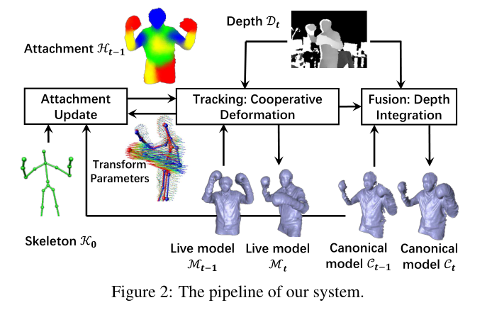
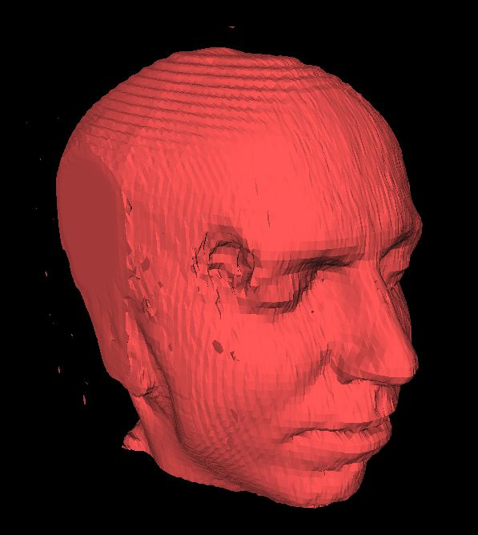
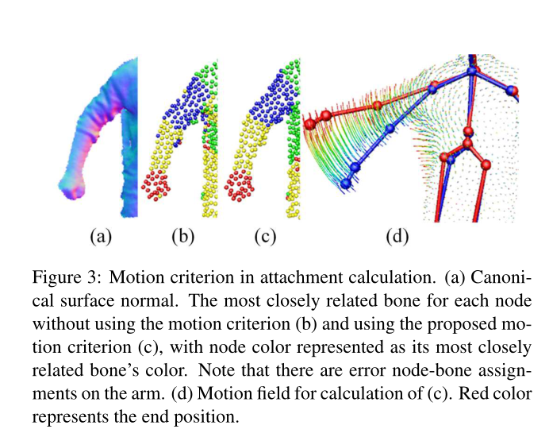
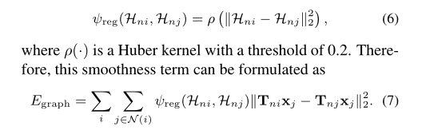
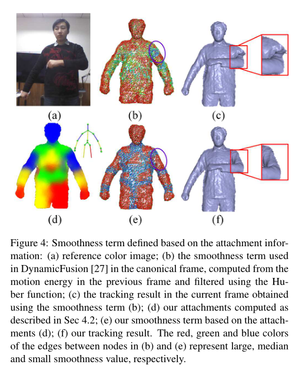
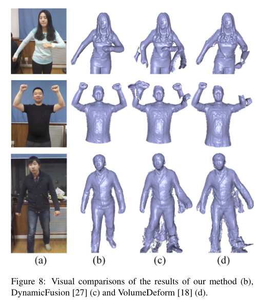
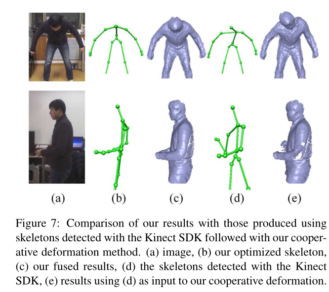
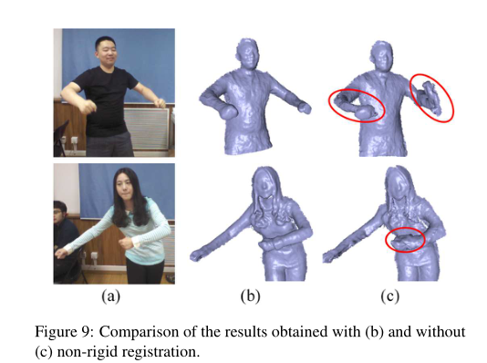
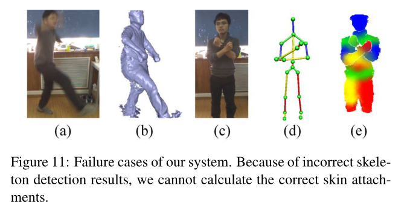

# BodyFusion

考虑内关节动作先验作为人体的表现，并且提出了骨骼embedded表面融合 （SSF）方法。

我们方法的关键特征是：它基于骨骼和图节点的附属信息，一并解决了骨骼和图节点形变

这个附属信息会 在表面几何和形变计算下一帧接一帧的 进行更新

## Introduction

为了达到更多的鲁棒性、实时性。我们考虑两个点

1. 人体是我们感兴趣的动态场景下的非刚性核心元素
2. 人类动作会有铰链式结构，铰链式动作(骨骼)能够被从非刚性形变中提取作为先验知识。来约束任何大型非刚性形变与骨骼一致。

基于这两个观点，SSF方法在骨骼和图节点上一起优化以实现动态表面融合。

## Related Work

### 基于骨架的表面重构

大多数基于骨架的表面重构需要 skeleton-embedded 网格模板，骨骼结构会被嵌入模板里面。骨架和表面顶点的附加信息会在追踪处理前被计算一次。**这种骨架的表示极大的减少了表面顶点的求解空间**，使得追踪更快和自然的动作成为可能。多视角RGB视频，双目视频、多视图深度视频和单深度视频都可以作为表面追踪处理的输入。我们的方法使用了**骨骼先验**而没有使用预先扫描的空间模板来做动态表面重构

### 非刚性表面追踪

大多数非刚性表面追踪方法需要mesh模板，**这些方法逐帧的对扫描的网格模板进行形变 来近似通常的非刚性目标的输入**，

1. 对网格模板稀疏采样，并求解这些稀疏点的形变参数。追踪低分辨率的形状模板，用深度序列信息更新几何信息
2. 使用预先扫描的mesh模板，跟踪非刚性目标
3. 通过利用目标的形状先验，可以对特定类别的目标进行非刚性表面追踪。

### 动态场景的追踪和重建

为了从动态场景恢复几何和动作信息，大多数方法需要通过非刚性配准整合时间信息

## Overview

和DynamicFusion 主要区别在于

1. Attachment Update
2. Cooperative Deformation，同时解决骨骼和图节点形变

附属信息用于协同形变的能量方程中的平滑项，而将形变信息反馈给附属信息进行更新

流程：

1. 在第一帧上检测骨架并嵌入参考帧
2. 计算附加信息(顶点到骨骼的权重信息)。作为前一帧的骨架和图节点形变参数的标准模型$C_{t-1}$ 
3. 对于每一深度帧$D_t$系统会用联合优化程序求解骨骼和图节点的形变参数
4. 计算附加信息$H_{t-1}$ 然后放进协同形变模型来作为平滑项
5. 用一个高斯牛顿方法来求解协同变形问题
6. 在当前深度帧$D_t$中获得对象的信息，然后融合进参考帧中来得到标准模型$C_t$

## Method

### Initialization

输入深度信息帧序列$D = [D_1,D_2,\ldots,D_n]$，对第一帧使用[marching-cube](https://www.jianshu.com/p/5a6ade7b77b6)算法提取三角平面，对曲面的形变节点均匀采样，构造**节点图**。

使用骨架检测(Skinect SDK)的3D位置，然后嵌入同一参考体中，然后计算初始皮肤附加信息

### marching-cube 等值面提取算法

更具点云重建物体表面

[marching cube算法学习笔记](https://www.jianshu.com/p/5a6ade7b77b6)

[Marching Cubes算法理解](https://zhuanlan.zhihu.com/p/48022195)

### Attachment Calculation

蒙皮问题是指：顶点和骨骼权重的描述 

[Ref:线性蒙皮分解](https://zhuanlan.zhihu.com/p/384760680) :

角色的每个定点都与某一根或者多根骨骼有关，骨骼的运动会带动顶点的运动，从而让角色动起来。因此，这里我们所拥有的已知数据是骨骼及其运动，以及每个顶点所绑定的骨骼的权重，我们所获得的结果是该模型顶点的运动（即每帧的位置信息）。这个技术也叫线性蒙皮

大多数用固定附件信息（不能实时），或者是将其作为热平衡问题（慢）。

我们用上了形变信息并保证实时

对于图节点中的每个节点$n_i$，蒙皮的权重可以表示为系数向量$H_{n_i} = [\eta_{i,1},\eta_{i,2},\ldots,\eta_{i,m}]$，$m$是骨骼数量。

1. 计算节点到骨骼的权重
2. 用k临近个节点到骨骼的权重对顶点到骨骼的权重进行插值

为每个节点$n_i$找到最相关的骨骼。逐个检查最近的骨骼，直到节点-骨骼对满足标准和正常的运动

法线指标：骨骼到节点的方向与节点平面法线一致 $\langle e_{i,j},n_{n_i} \rangle \lt \theta$， $e_{i,j}$是骨骼最近点到节点$n_i$的归一化方向向量。$n_{n_i}$是节点$n_i$的平面法向量

骨骼划分？

法向量？

运动指标：$|T_{bj} \mathbf x_i - T_{ni} \mathbf x_i| \lt t$ ，$T_{bj}$第$j$个骨骼的累计运动，$T_{ni}$节点$n_i$的非刚性累计运动

为每个图节点构造一个骨骼集合，如果第$j$个骨骼密切相关$n_{i,j} = 1$。否则为0

空间维度上：通过8个相邻节点的平均$H_{n_i}$来平滑节点

时间维度上：然后使用5个相邻时间窗口来过滤每个节点的附加信息

插值顶点-骨骼的权重**附件信息**。求得每个顶点与哪几个骨骼相关的向量：
$$
H_{v_i} = {1 \over Z} \sum_{k \in N(v_i)} \lambda_{i,k}H_{n,k}
$$
 $H_{v_i}$第$i$个顶点的附件信息（顶点到骨骼的权重）

$N(v_i)$ 第$i$个顶点的邻接点

$Z$ 正则化系数

$\lambda_{i,k}$在$v_i$顶点中第$k$个节点的空间影响权重 $\lambda_{i,k} = \exp(-||\mathbf v_i - \mathbf x_k||_2^2 / (2\sigma_k))$ 。$\mathbf v_i、\mathbf x_k$分别是第$i$个顶点和第$k$个节点的三维坐标，越接近顶点坐标的影响权重越大

$\sigma_k$是第$k$个节点的影响半径

## 协同形变

$$
E_t = \lambda_n E_{nonrigid} + \lambda_s E_{skeleton} + \lambda_g E_{graph} + \lambda_b E_{binding}
$$

$E_{nonrigid}$节点拟合误差

$E_{skeleton}$骨骼拟合误差

$E_{graph}$ 图节点的空间约束

$E_{binding}$ 骨骼和图节点形变一致性

$E_{nonrigid}$ 和 $E_{skeleton}$ 的计算使用点云配准算法(ICP)的点到面公式作为拟合项（每个源点到目标点所在平面的距离）
$$
\begin{cases}
E_{nonrigid} = \sum_{(v_i,u_i) \in p}|\hat{\mathbf n}_{v_1}({\hat{\mathbf v_i} - \mathbf u_i})|^2 \\

E_{skeleton} = \sum_{(v_i,u_i) \in p}|\widetilde{\mathbf n}_{v_1}({\widetilde{\mathbf v_i} - \mathbf u_i})|^2 \\
\end{cases}
$$
$\hat {\mathbf v}_{i}$代表顶点坐标

$\hat {\mathbf n}_{v_i}$ k个邻近计算后的法线向量
$$
\hat {\mathbf v}_i = \sum_{j \in N(v_i)} w_{i,j}\mathbf T_{nj} \mathbf v_i \\
\hat {\mathbf n}_{v_i} = \sum_{j \in N(v_i)} w_{i,j}\mathbf T_{nj} \mathbf n_{v_i}
$$
$w_{i,j}$定义与$\lambda_{i,k}$类似，是第$j$个节点对顶点$v_i$的影响因子

$T_{n,j}$第j个节点的形变

$\widetilde {\mathbf v}_i$， $\widetilde{\mathbf n}_{v_1}$定义如下
$$
\widetilde {\mathbf v}_i = \sum_{j \in B} \eta_{i,j}\mathbf T_{bj} \mathbf v_i \\
\widetilde {\mathbf n}_{v_i} = \sum_{j \in B} \eta_{i,j}\mathbf T_{bj} \mathbf n_{v_i}
$$
 $T_{bj}$第j个骨骼的形变，由骨骼扭转指数映射计算得到 $T_i = \exp(\hat \zeta_i)$

$\eta_{i,j}$是第$j$个节点对顶点$v_i$的附加信息权重

#### ICP 点云配准算法

匹配两个点云之间点的关系

平面方程：
$$
Ax + By + Cz + D = 0
$$
法向量:$P_n = (A,B,C)$

点到面距离公式：
$$
dis = {|Ax_0 + B y_0 + Cz_0 + D| \over \sqrt {A^2+B^2+C^2}} =P_n \cdot x \cdot M
$$

Ref:[点云配准论文阅读笔记](https://blog.csdn.net/qq_41102371/article/details/111143174)

[Efficient_variants_of_the_ICP_algorithm.pdf](./Efficient_variants_of_the_ICP_algorithm.pdf)

[基于高斯牛顿的点-点，点-线，点到面ICP过程推导](https://blog.csdn.net/baidu_34319491/article/details/109289804)

### Smoothness term

驱动不可见区域随着可见区域平滑形变

平滑项依赖附件信息，见$Fig:4d$

基于点$i,j$之间的平滑度函数定义为：

$H_{ni}$为点$i$的骨骼权重信息

### Huber Loss

$$
L_\delta(y,f(x)) =
\begin{cases}
 {1 \over 2}(y-f(x))^2 & for \ |y-f(x)| \le \delta \\
 \delta \cdot(|y-f(x)|) - {1 \over 2}\delta & otherwise
\end{cases}
$$

### binding term

保证骨骼和节点的形变一致 提出了这个函数
$$
E_{binding} = \sum_{i=1}^N ||\mathbf T_{n_i} \mathbf x_i - \widetilde{\mathbf x}_i||_2^2
$$
$\mathbf x_i$表示第$i$个节点的坐标

$ \widetilde{\mathbf x}_i$ 骨架形变后的坐标

在点云配准的时候，使用高斯牛顿求解器来最小化等式2

### Gauss-Newton Solver

线性运动的一阶泰勒展示，表示成：$T_{ni} = I + \hat \zeta_i$、$T_{bi} = I + \theta_0 \hat \xi_0 + \sum_{k \in K_i}$

$\hat \zeta_i$ $\hat \xi_i$都是$4 \times 4$的斜矩阵，通过预处理共轭梯度PCG方法求解方程

#### PCG预处理共轭梯度

[CG 和 PCG 算法实现和分析](https://blog.genkun.me/post/cg-pcg-implementation/)

[共轭梯度法简介](https://zhuanlan.zhihu.com/p/178461470)

### Depth 

协同优化后，将当前深度信息集成到参考体中，对新添加的表面均匀采样并更新节点

## 结果

骨架对比

等式2中非刚性部分对比

第一帧检测不准确会导致系统失败

