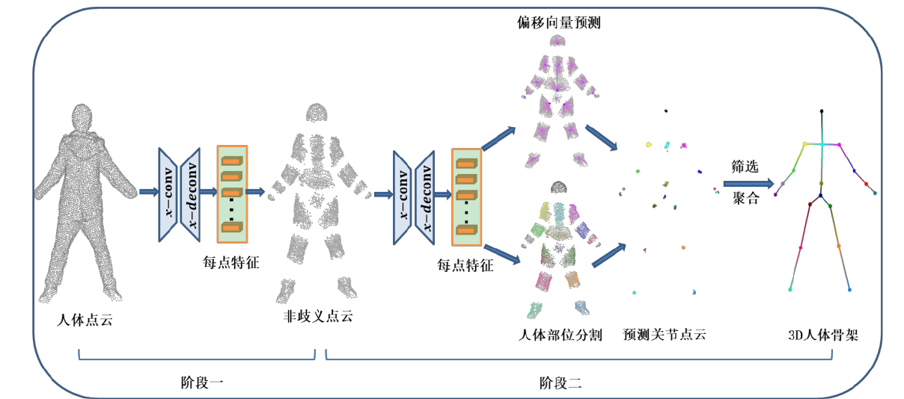

# 基于深度学习的人体点云骨架提取方法研究_张嵩山

Backbone:PointCNN

输入：三维点云

点云预处理：点云目标检测

第一阶段，剔除原始点云院里关节部位的歧义点

第二阶段：预测对关节偏移量，以及点所属部位。

沿关节点偏移量收缩，筛选并聚合

数据集：UBC3V，仿真小规模人体点云数据集

# Skeleton Extraction from 3D Point Clouds by Decomposing the Object into Parts (通用骨架提取)

生成候选区域，选择候选区域的最优子集构成整个点云，生成骨架

# RGB-D FUSION FOR POINT-CLOUD-BASED 3D HUMAN POSE ESTIMATION

估计出偏移向量和接近度分数，逐点加权得到最后骨架

**dataset**:MHAD,SURREAL

实时：47.6 FPS

# PointCNN: Convolution On X -Transformed Points

通用点云特征提取卷积

# Point2Skeleton: Learning Skeletal Representations from Point Clouds

通用点云骨架提取

无监督

dataset:ShapeNet,2000个点8类7088个物体

backbone:PointNet++

# SkeletonNetV2: A Dense Channel Attention Blocks for Skeleton Extraction

通用骨骼提取

输入可以是图片也可以是点云

Dataset:Pixel SkeletonNet

# Learning to Estimate 3D Human Pose From Point Cloud

基于PointNet和DGCNN的点云检测

backbone:PointNet,DGCNN

数据集EVAL,ITOP

无pipeline

# PointNet: Deep Learning on Point Sets for 3D Classification and Segmentation

基于点云的特征提取网络，用于分类和语义分割任务

Code: https://github.com/charlesq34/pointnet

解读：https://blog.csdn.net/qq_41685265/article/details/107283443

# PointNet++: Deep Hierarchical Feature Learning on Point Sets in a Metric Space

PointNet 增强版

Code:https://github.com/charlesq34/pointnet2

# A 3-D-Point-Cloud System forHuman-Pose Estimation

输入：VISH的点云

非参数AMM和细化(运动学模型)对模型进行处理

dataset: Stanford TOF Motion Capture Dataset 

# A 3D-Point-Cloud Feature for Human-Pose Estimation

同上

# 3D Joints Estimation of the Human Body in Single-Frame Point Cloud

Dataset:自制, G3D