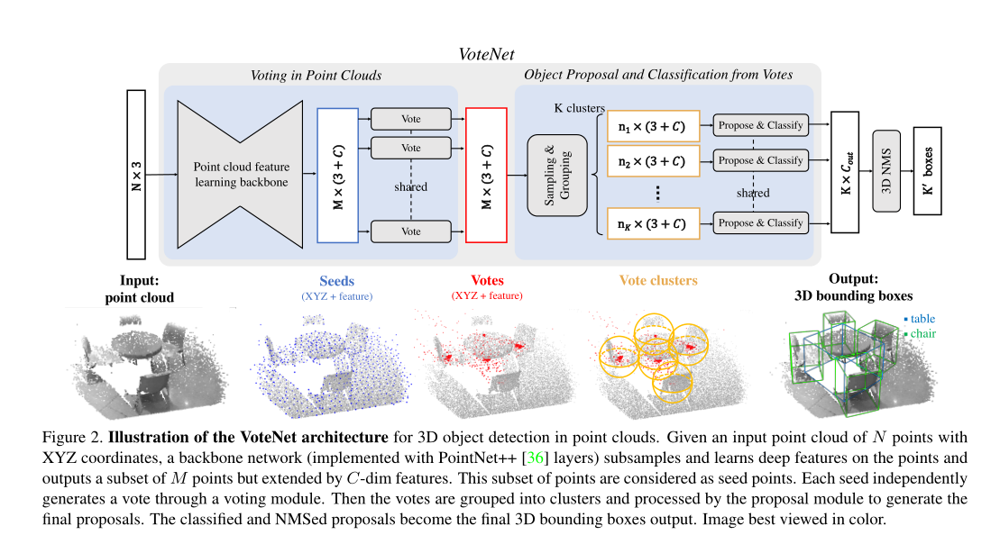
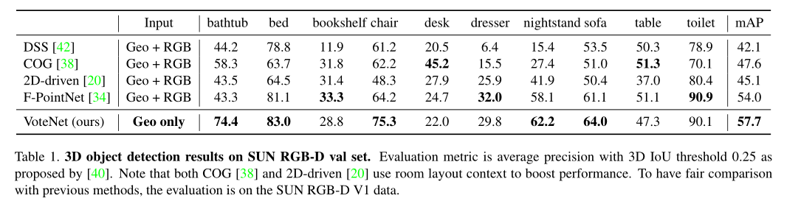
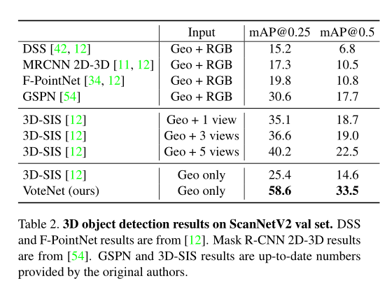
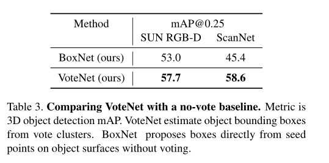
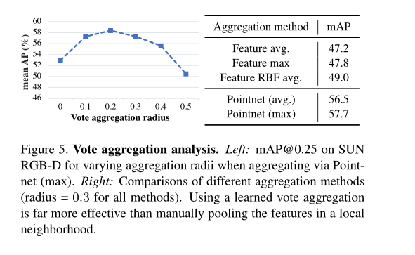

# VoteNet

斯坦福+FaceBook AI，2019 ICCV

通用的3D点云目标检测器。

端到端的3D目标检测网络：基于深度点集网络、Hought投票

## Introduction

点云具有不规则性和稀疏性

现有的方法：

1. Faster/Mask R-CNN扩充至3D。将不规则的点云体素化为3D网格。缺点无法利用数据的稀疏性，计算代价过高(3D卷积)
2. 使用鸟瞰图，用2维检测器定位对象。缺点牺牲几何细节
3. 两步级联：第一步使用直视图检测2D目标，第二步在点云中定位目标。缺点是:2D检测要准

基于PointNet++

## Related Work

### 3D Object detection

MV3D/VoxelNet：3D简化为鸟瞰图，通过先处理2D检测来减少搜索空间

### 目标检测中的Hough投票算法

## Deep Hough Voting

#### 传统Hough Voting 2D检测器（2D Hough Voting detector）

1. 给定一组带有Bounding-box 标签的图像集合，通过图像patches和到对应目标中心的偏移量构造codebook，dict = {patches:offset}
2. 推理的时候，从图像中提取感兴趣的点周围的图片patches
3. 这些patches和codebook中的图像patches进行比较，索引得到偏移量来计算投票。同一个对象的patches会倾向于投同样的票。因此会从目标中心点附近产生聚类。
4. 最后通过回溯聚类的投票到patches上，就可以生成目标的边界

HoughVoting 相比于 RPN（region proposal networks）

1. 更适合稀疏的点积，后者需要在目标的中心附近生成候选区域，而目标中心可能在空白区域会导致额外的计算
2. 这是基于自下而上的原理：少量的部分信息累积成可信的检测

#### 调整

##### Interest point

被深度神经网络选择替代手工特征

##### Vote

通过网络学习来替代codebook。通过网络学习，可以更具更大的感受野使得投票更有确定性。并且投票的location能够被特征向量进行增强

##### Vote aggregation 

通过可学习的点云处理层实现，这个可以过滤掉低质量的投票

##### Object Proposals

从投票聚合层生成：location/dimentsions/orientation/semantic classes

## VoteNet

两部分：一部分处理点云生成投票，一部分处理投票生成检测对象

### 投票生成部分

input:$(N \times 3)$，输入N个三维坐标点

output:$(M \times (3+C))$ ，输出M个投票，投票由3个坐标和C维长度的向量组成

输入通过Backbone后得到点云的特征，然后在Seeds上使用用Hough Vote方法

### 点云特征学习

BackBone: [PointNet++](./PointNet++.pdf)

### Hough Voting with deep network

用深度网络来做投票

给定一个Seeds Point的集合$\{s_i\}_{i=1}^M$，$s_i = [x_i;f_i]$，$x_i \in \mathbb R^3（坐标），f_i \in \mathbb R^C （特征）$ 

共享的投票网络为每一个Seed生成投票

投票网络由带有全连接、Relu、批正则化的多层感知机(MLP)实现

MLP 输入特征$f_i$，输出欧式空间偏移$\Delta x_i \in \mathbb R^3$ 和特征偏移$\Delta f_i \in \mathbb R^C$

投票结果 $v_i = [y_i;g_i]$，$y_i = x_i + \Delta x_i $ ，$g_i = f_i + \Delta f_i$

$\Delta x_i$通过回归损失进行监督
$$
L_{vote-reg} = {1 \over M_{pos}} \sum_{i} ||\Delta x_i - \Delta x_i^*|| \mathbb 1[s_i \ on \ object]
$$
$\mathbb 1[s_i \ on \ object]$ 表明seed点$s_i$是否在目标表面，$M_{pos}$是物体表面seed点的个数。$\Delta x_i^*$是seed点$s_i$与目标中心点(GT)之间的位移

### Object Proposal and Classification

在获得通过seed投票后的vote点之后，通过对这些点进行聚类，可以得到聚合后的特征并对其提出Proposal和分类

#### Vote Clustering

使用平均采样和通过空间接近性来进行分组

对于一个点集$\{v_i = [y_i;g_i] \in \mathbb R^{3+C} \}_{i=1}^M$

基于点$y_i$在3D欧式空间的最远点获取一个子集$K = \{v_{i_k} \}，k = 1,\ldots,K$

然后对子集的每个点通过3D位置的临近点公式生成$K$个簇 。 $C_k = \{v_i^{(k)} ||v_i - v_{i_k}|| \le r \}$

#### Proposal and Classification

使用通用点集学习网络 类似[pointNet](./pointNet.pdf)  聚合投票生成proposal

给定一个点簇$C = \{ w_i \},i = 1,\ldots,n$，簇中心为$w_j$，其中$w_i = [z_i;h_i]，z_i \in \mathbb R^3 ，h_i \in \mathbb R^C$，

将投票的坐标转换成归一化后的坐标系 $z_i^{’} = (z_i - z_j) / r$

将这个点集输入到PointNet网络后就可以输出点簇$C$的proposal
$$
p(C) = MLP_2 
\begin{cases}
\max_{i=1,\ldots,n} \{ MLP_1([z_i^{'};h_i]) \}
\end{cases}
$$
每个簇的投票被$MLP_1$处理，然后通过通道方向的$max$池化，然后送到$MLP_2$处理

##### Loss

分类损失：交叉熵

框损失：参考【Frustum pointnets for 3d object detection from rgbd data. 】

### 实现细节

数据增强

3DNMS后处理

## 数据集

SUN RGB-D

ScanNetV2

## Result

3D-SIS再不同个数视角下的结果

## 消融实验

投票模块的效果 boxnet 不带投票，VoteNet有投票

不同投票聚类方法的效果，
